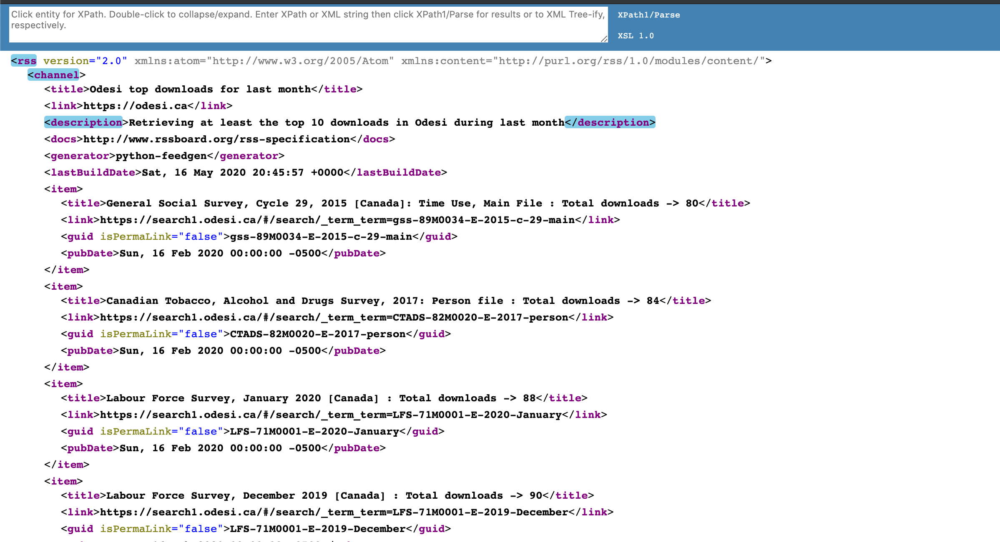

[


](https://pypi.org/project/ask_schools/)
[](https://travis-ci.org/guinslym/ask_schools)

<hr/>

## top 10 odesi downloads

<p>
Will connect to ODESI database and retrieve the top 10 survey downloaded during the previous month. It will create a JSON file containings those downloads.
</p>

## Installation & Usage


**need credentials to connect to db** need a secrets.json file

```python 
#using poetry
pip install poetry
poetry run python top_downloads.py
```

To run an example of the app
```python 
poetry run python Flask_app.py
```

## Screenshots
This is an example of the app using data in downloads.json
<p float="left">
    
</p>

### TODO
1. Add Docker
2. Test
3. Change repo name to add -script